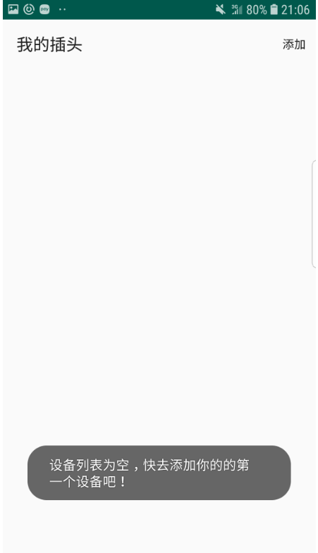
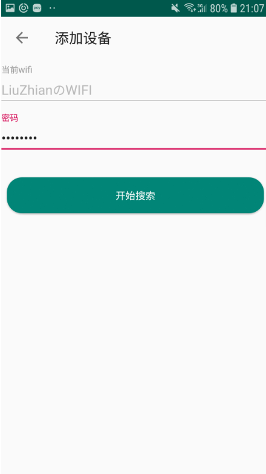
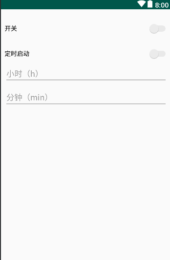

# plug_control
基于机智云和 esp8266-12F WIFI 模块的智能插座控制安卓APP

##  feature

- [x] 手机插座WiFi配对
- [x] 远程控制开关
- [x] 定时开启/关闭
- [x] 倒计时开启/关闭
- [x] 温度/湿度显示

## 界面

主界面：

配对界面：

配置界面：

设置别名：

## LICENSE

> Copyright 2018 getianao
>
> Licensed under the Apache License, Version 2.0 (the "License"); you may not use this file except in compliance with the License. You may obtain a copy of the License at
>
> <http://www.apache.org/licenses/LICENSE-2.0>
>
> Unless required by applicable law or agreed to in writing, software distributed under the License is distributed on an "AS IS" BASIS, WITHOUT WARRANTIES OR CONDITIONS OF ANY KIND, either express or implied. See the License for the specific language governing permissions and limitations under the License.